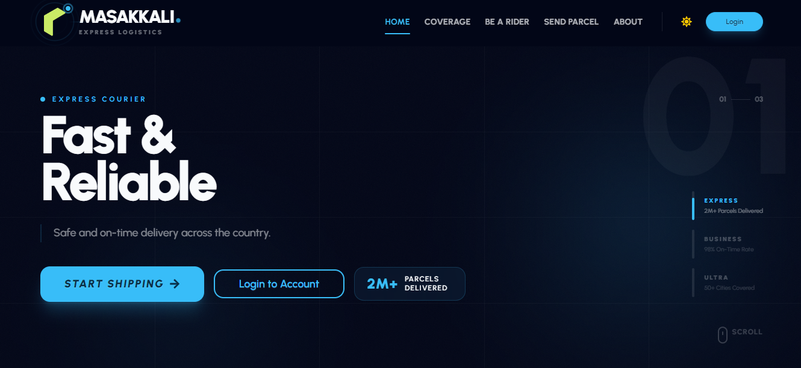

<div align="center">



<br/>
<br/>


<br/>

<p>
  <strong>A production-grade logistics platform with three role-based portals,<br/>
  real Stripe payments, Firebase auth, live parcel tracking, and a 16-query<br/>
  parallel MongoDB aggregation engine — covering all 64 districts of Bangladesh.</strong>
</p>

<br/>

<p>
  
  
  
  
  
  
</p>

<p>
  <a href="https://masakkali.vercel.app">
    
  </a>
  &nbsp;&nbsp;
  <a href="https://github.com/YOUR_USERNAME/masakkali-server">
    
  </a>
</p>

</div>

---

## 🔐 Try It Live — No Signup Needed

> Three pre-seeded accounts, one for each role. Jump straight into any portal.

<table>
<thead>
<tr>
<th>Role</th>
<th>Email</th>
<th>Password</th>
<th>What to explore</th>
</tr>
</thead>
<tbody>
<tr>
<td>👤 <strong>Customer</strong></td>
<td><code>admin4@gmail.com</code></td>
<td><code>123456aA</code></td>
<td>Book a parcel → pay via Stripe test card → watch live tracking update</td>
</tr>
<tr>
<td>🛵 <strong>Rider</strong></td>
<td><code>admin11@gmail.com</code></td>
<td><code>123456aA</code></td>
<td>Pick up the task → mark delivered → watch earnings wallet update</td>
</tr>
<tr>
<td>🛡️ <strong>Admin</strong></td>
<td><code>admin1@gmail.com</code></td>
<td><code>123456aA</code></td>
<td>Approve riders → assign deliveries → view revenue analytics dashboard</td>
</tr>
</tbody>
</table>

<details>
<summary><strong>💳 Stripe Test Card Details</strong></summary>
<br/>

```
Card Number : 4242 4242 4242 4242
Expiry      : Any future date  (e.g. 12/29)
CVC         : Any 3 digits     (e.g. 123)
ZIP         : Any 5 digits     (e.g. 10001)
```

No real money is charged. This runs on Stripe's test environment.

</details>

---

## 🎯 What Is Masakkali?

Masakkali is a **home & office pickup parcel delivery platform** that models how a real-world courier business operates — end-to-end, from customer booking through rider dispatch to admin oversight.

This is not a UI showcase. It is a fully-integrated system with:
- Live database (MongoDB Atlas) with real seeded parcel and payment data
- Server-side **cost validation** — pricing is recalculated on the backend and compared against the frontend value before any parcel is inserted (prevents price tampering)
- **Firebase JWT** verification on every protected route
- **Stripe PaymentIntents** flow with webhook-ready payment recording
- **16 parallel MongoDB aggregation queries** powering the admin overview in a single round-trip
- Animated, mobile-first dashboards for all three roles using Framer Motion + Recharts

---

## ✨ Feature Breakdown

<details>
<summary><strong>👤 Customer Portal</strong></summary>
<br/>

| Feature | Detail |
|---------|--------|
| **Parcel Booking** | Multi-step form with automated cost calculation — document vs non-document, weight tiers, same vs inter-district |
| **Stripe Payment** | Full PaymentIntent flow — card UI, confirmation, payment recorded to DB and parcel marked paid |
| **Live Tracking** | Public tracking page — unique `PCL-YYYYMMDD-XXXXX` ID, full event timeline with location + timestamp |
| **Dashboard** | Single API endpoint returns stats, active parcel tracker with progress stepper, recent parcels, spend chart, status donut (Recharts) |
| **Payment History** | Transaction IDs, amounts, dates — everything a real customer needs |

</details>

<details>
<summary><strong>🛵 Rider Portal</strong></summary>
<br/>

| Feature | Detail |
|---------|--------|
| **Task Queue** | Live queue of assigned + in-transit parcels, colour-coded by delivery type |
| **Pickup Flow** | One-tap pickup confirmation → parcel status → `in-transit`, tracking event logged |
| **Delivery Flow** | Delivery confirmation → status → `delivered`, `delivered_at` timestamp written |
| **Earnings Wallet** | Lifetime / weekly / monthly breakdown, settled vs pending cashout, commission rate display |
| **Cashout** | Rider requests cashout → admin marks as cashed → wallet updates |
| **Dashboard** | Profile card, active queue preview, delivery type split (inter 30% / same 80%), Recharts bar chart |

</details>

<details>
<summary><strong>🛡️ Admin Command Centre</strong></summary>
<br/>

| Feature | Detail |
|---------|--------|
| **Overview KPIs** | 16 parallel MongoDB queries — revenue today/7d/30d, parcel counts, status breakdown, top districts, 7-day sparkline |
| **Pending Riders** | Review applicant cards with NID, bike info, region → approve or reject with inline confirm |
| **Rider Assignment** | Assign rider to parcel filtered by matching district — shows rider phone for coordination |
| **User Management** | View all users, last login, role badges — promote any user to admin with one click |
| **Role Guard** | `verifyAdmin` middleware on every admin route — rider/customer tokens are rejected server-side |

</details>

---

## 🏗️ Architecture

```
┌──────────────────────────────────────────────────────┐
│                  React 19 Frontend (Vite)            │
│                                                      │
│   Customer Portal    Rider Portal    Admin Portal    │
│        │                  │               │          │
│        └──────────────────┼───────────────┘          │
│                    TanStack Query v5                 │
│              (cache, background refetch)             │
└───────────────────────────┬──────────────────────────┘
                            │
                   Axios + Firebase JWT
                   (Authorization header)
                            │
┌───────────────────────────▼──────────────────────────┐
│                   Express 5 API Server               │
│                                                      │
│  verifyFBToken   →  verifyAdmin / verifyRider        │
│  (Firebase Admin SDK token decode + role check)      │
│                                                      │
│  Route Handlers:                                     │
│  /users  /parcels  /riders  /payments  /tracking     │
│  /admin  /rider   /track   /stripe                   │
└───────────────────────────┬──────────────────────────┘
                            │
┌───────────────────────────▼──────────────────────────┐
│                   MongoDB Atlas                      │
│                                                      │
│   users ──── parcels ──── tracking                   │
│                │                                     │
│           payments   riders                          │
│                                                      │
│   Aggregation pipelines: $match + $group + $project  │
│   Parallel execution: Promise.all([...16 queries])   │
└──────────────────────────────────────────────────────┘
```

---

## 🛠️ Full Tech Stack

| Layer | Technology | Version | Purpose |
|-------|-----------|---------|---------|
| Frontend framework | React | 19 | UI with concurrent rendering |
| Build tool | Vite | 7 | Sub-second HMR, optimised bundles |
| Routing | React Router | 7 | Nested layouts, protected routes |
| Server state | TanStack Query | 5 | Caching, stale-time, auto-refetch |
| Styling | Tailwind CSS + DaisyUI | 4 / 5 | Utility-first + light/dark theme |
| Animation | Framer Motion | 12 | Spring physics, scroll-triggered reveals |
| Charts | Recharts | 3 | Donut + bar + radial charts |
| Forms | React Hook Form | 7 | Validated, uncontrolled forms |
| Maps | React Leaflet | 5 | Coverage zone visualisation |
| Payments (client) | Stripe.js + React Stripe | 8 | Card element, PaymentIntent |
| Auth (client) | Firebase SDK | 12 | Google / email-password auth |
| Backend | Express | 5 | REST API, async error handling |
| Database | MongoDB | 7 | Atlas hosted, aggregation pipelines |
| Auth (server) | Firebase Admin SDK | 13 | JWT decode + verification |
| Payments (server) | Stripe Node | 20 | PaymentIntent creation |

---

## 📁 Project Structure

```
client/
├── public/
│   └── preview.png              ← Hero screenshot for README
├── src/
│   ├── components/
│   │   ├── ErrorLoadingState.jsx
│   │   ├── Navbar.jsx
│   │   └── Footer.jsx
│   ├── hooks/
│   │   ├── useAuth.js           ← Firebase current user
│   │   ├── useAxiosSecure.js    ← Axios instance with JWT header
│   │   ├── useUserRole.js       ← Fetches + caches user role
│   │   └── useScrollTo.js       ← Scroll to top on route change
│   ├── pages/
│   │   ├── Home/                ← Landing, HowItWorks, Coverage, Features
│   │   ├── About/               ← Full about page (roles, pricing, stack)
│   │   ├── Auth/                ← Login, Register, Forbidden (role-aware)
│   │   └── Dashboard/
│   │       ├── Admin/
│   │       │   ├── AdminDashboard.jsx    ← 16-query KPI overview
│   │       │   ├── PendingRiders.jsx     ← Rider approval flow
│   │       │   ├── RiderReviewModal.jsx  ← Application detail + action
│   │       │   └── MakeAdmin.jsx         ← User role management
│   │       ├── Rider/
│   │       │   ├── RiderDashboard.jsx    ← Earnings, queue, profile
│   │       │   ├── PendingDeliveries.jsx ← Active task list
│   │       │   ├── CompletedDeliveries.jsx
│   │       │   └── RiderEarnings.jsx
│   │       └── User/
│   │           ├── UserDashboard.jsx     ← Stats, active tracker, charts
│   │           ├── SendParcel.jsx        ← Booking + Stripe payment
│   │           ├── MyParcels.jsx
│   │           └── PaymentHistory.jsx
│   └── routes/
│       ├── AdminRoute.jsx
│       ├── RiderRoute.jsx
│       └── PrivateRoute.jsx

server/
└── index.js                     ← All Express routes + middleware
```

---

## 💰 Business Logic — Pricing

```
DOCUMENT  (any weight)
├── Same district   →  ৳ 60
└── Inter district  →  ৳ 80

NON-DOCUMENT  (weight-based)
├── Base ≤ 3 kg
│   ├── Same district   →  ৳ 110
│   └── Inter district  →  ৳ 150
├── Extra weight (per kg above 3 kg)  →  + ৳ 40 / kg
└── Inter district surcharge           →  + ৳ 40

RIDER COMMISSION
├── Same district   →  80%  of parcel cost
└── Inter district  →  30%  of parcel cost
```

> Pricing is **calculated independently on the server** and verified against the client-submitted value before insertion. A mismatch returns `400 Bad Request`.

---

## 🗺️ Key API Endpoints

| Method | Endpoint | Auth | Description |
|--------|----------|------|-------------|
| `GET` | `/health` | Public | Server + DB status |
| `POST` | `/users` | Public | Upsert user on login |
| `GET` | `/users/:email/role` | Private | Get own role |
| `GET` | `/users/dashboard` | Private | All-in-one customer dashboard |
| `PATCH` | `/users/:id/role` | Admin | Promote / demote role |
| `GET` | `/admin/overview` | Admin | 16-query KPI aggregation |
| `GET` | `/riders/pending` | Admin | Pending rider applications |
| `PATCH` | `/riders/:id` | Admin | Approve or reject rider |
| `POST` | `/parcels` | Private | Create parcel (server validates cost) |
| `PATCH` | `/parcels/:id/assign-rider` | Admin | Assign rider |
| `PATCH` | `/parcels/:id/pickup` | Rider | Confirm pickup |
| `PATCH` | `/parcels/:id/deliver` | Rider | Confirm delivery |
| `GET` | `/rider/dashboard` | Rider | All-in-one rider dashboard |
| `GET` | `/rider/tasks` | Rider | Active task queue |
| `GET` | `/riders/earnings-summary` | Rider | Full earnings breakdown |
| `GET` | `/track/:trackingId` | Public | Full tracking timeline |
| `POST` | `/create-payment-intent` | Public | Stripe PaymentIntent |
| `POST` | `/payments` | Public | Record payment + mark parcel paid |

---

## 🔒 Security

- Every protected route verifies the Firebase JWT via `firebase-admin` on the server — tokens signed by Firebase, decoded and checked server-side
- `verifyAdmin` and `verifyRider` middleware check the user's role from MongoDB — changing the role claim in the token alone does nothing
- Email-ownership check on user-scoped endpoints — you cannot query another user's data even with a valid token
- Rider role is explicitly blocked from the admin-only role promotion endpoint
- Stripe keys are server-only — the client only receives the PaymentIntent `client_secret`

---

## 🚀 Run Locally

### Prerequisites
- Node.js 18+
- MongoDB Atlas cluster URI
- Firebase project with service account JSON
- Stripe account (test mode)

### Clone

```bash
git clone https://github.com/YOUR_USERNAME/masakkali-client
git clone https://github.com/YOUR_USERNAME/masakkali-server
```

### Server `.env`

```env
PORT=5000
DB_USER=your_atlas_username
DB_PASS=your_atlas_password
Stripe_KEY=sk_test_xxxxxxxxxxxxxxxx
FB_SERVICE_KEY=base64_of_firebase_service_account_json
```

```bash
cd masakkali-server && npm install && npm run dev
```

### Client `.env.local`

```env
VITE_API_URL=http://localhost:5000
VITE_FIREBASE_API_KEY=AIza...
VITE_FIREBASE_AUTH_DOMAIN=your-app.firebaseapp.com
VITE_FIREBASE_PROJECT_ID=your-app
VITE_FIREBASE_STORAGE_BUCKET=your-app.appspot.com
VITE_FIREBASE_MESSAGING_SENDER_ID=000000000000
VITE_FIREBASE_APP_ID=1:000:web:000
VITE_STRIPE_PK=pk_test_xxxxxxxxxxxxxxxx
```

```bash
cd masakkali-client && npm install && npm run dev
```

---

## 📸 Screenshots

| Page | Preview |
|------|---------|
| Landing |  |
| Customer Dashboard |  |
| Rider Dashboard |  |
| Admin Command Centre |  |
| Live Tracking |  |
| Parcel Booking + Payment |  |

---

## 👤 Author

**[Your Name]**

[](https://yourportfolio.dev)
[](https://linkedin.com/in/yourhandle)
[](https://github.com/YOUR_USERNAME)

---

<div align="center">
  <sub>
    Built with precision · Full-stack · Production-grade · Bangladesh 🇧🇩 · 2026
  </sub>
</div>